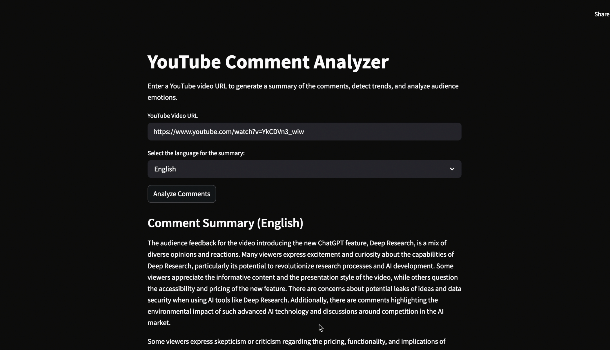

# LLM YouTube Project

This project leverages the power of Large Language Models (LLMs) to extract, understand, and interact with the content of a YouTube video. By combining automatic transcription, smart text chunking, semantic embeddings, and vector search, it allows users to ask precise questions and receive accurate answers based solely on the video content.

## Features

- YouTube video content extraction via URL
- Automatic transcription of the video
- Smart text chunking for coherent semantic segmentation
- Embedding generation using OpenAI's `text-embedding-3-small`
- Semantic search powered by Pinecone vector database
- Contextual Q&A based on the video using OpenAI's `gpt-3.5-turbo`

## Tech Stack

- OpenAI API
- YouTube Transcript API
- Streamlit (for UI, if applicable)

## How It Works

1. The user provides a YouTube video URL.
2. The transcript is automatically retrieved (or generated).
3. The transcript is split into overlapping chunks to preserve context.
4. Each chunk is transformed into a semantic vector (embedding).
5. The vectors are stored in Pinecone.
6. When the user asks a question, the most relevant chunks are retrieved and passed to the LLM.
7. The LLM generates an answer using only the retrieved video content.

## Use Cases

- Quickly understanding the key points of long-form video content
- Searching for specific topics discussed in a video
- Extracting insights from podcasts, interviews, or lectures
